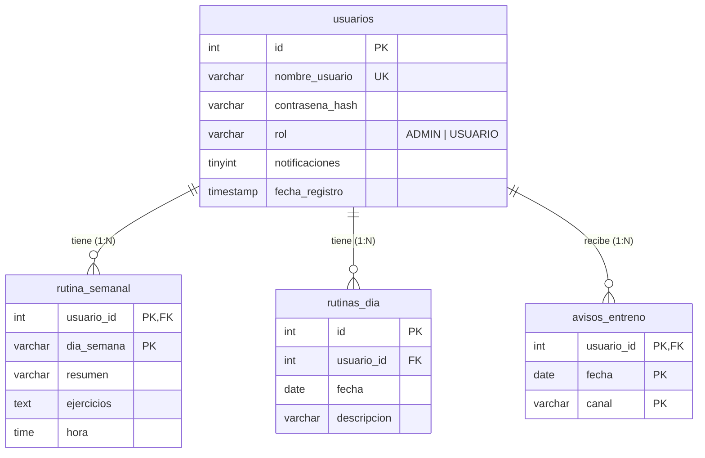

# Modelo de datos

```mermaid
erDiagram
    usuarios ||--o{ rutina_semanal : "tiene (1:N)"
    usuarios ||--o{ rutinas_dia : "tiene (1:N)"
    usuarios ||--o{ avisos_entreno : "recibe (1:N)"

    usuarios {
        int id PK
        varchar nombre_usuario UK
        varchar contrasena_hash
        varchar rol "ADMIN | USUARIO"
        tinyint notificaciones
        timestamp fecha_registro
    }
    rutina_semanal {
        int usuario_id PK, FK
        varchar dia_semana PK
        varchar resumen
        text ejercicios
        time hora
    }
    rutinas_dia {
        int id PK
        int usuario_id FK
        date fecha
        varchar descripcion
    }
    avisos_entreno {
        int usuario_id PK, FK
        date fecha PK
        varchar canal PK
    }
```

Todas las claves foráneas usan `ON DELETE CASCADE`: al borrar un usuario se borran sus rutinas y avisos.
